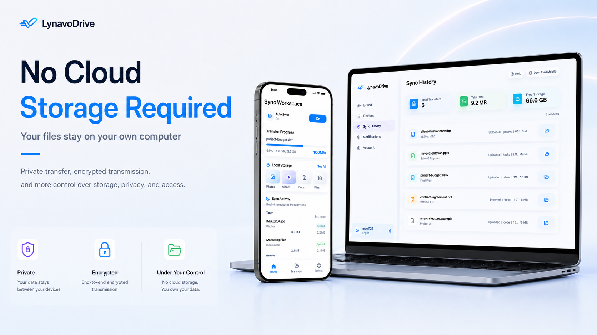

<p align="center">
  <a href="./README.md">English</a> | <strong>繁體中文</strong>
</p>

<p align="center">
  
</p>

<p align="center">
  
</p>

<h1 align="center">Lynavo Drive</h1>

<p align="center">
  <strong>一款高效能、從行動端（iOS / Android）至桌面端（macOS / Windows）的區域網路 (LAN) 增量同步媒體工具。</strong>
</p>

<p align="center">
  <a href="https://github.com/lynavo/lynavo-drive/actions/workflows/oss-release-gate.yml"></a>
  
  
  
  
  
</p>

<p align="center">
  <a href="#-產品預覽">產品預覽</a> •
  <a href="#-主要功能">主要功能</a> •
  <a href="#-開發者快速開始">開發者快速開始</a> •
  <a href="#-開源邊界">開源邊界</a> •
  <a href="#-參與貢獻">參與貢獻</a>
</p>

---

## 專案狀態

Lynavo Drive 已完成主要功能，並開放社群從原始碼建置與參與貢獻。本儲存庫只提供一套公開的本機原始碼建置與套件驗證流程；不發布官方簽署的安裝程式、行動應用程式商店版本、自動更新或託管服務。

| 使用範圍 | 目前的開源版本支援範圍                             |
| -------- | -------------------------------------------------- |
| 桌面端   | macOS 與 Windows 應用程式執行環境                  |
| 行動端   | iOS 與 Android 應用程式執行環境                    |
| Linux    | 僅供本機原始碼建置與套件驗證                       |
| 網路     | 同一區域網路中的前景同步                           |
| 發布方式 | 社群原始碼建置，以及在本機產生的套件／二進位執行檔 |

## 📸 產品預覽

<p align="center">
  
</p>

## ✨ 主要功能

- **自動增量媒體同步**：掃描手機相簿，自動將尚未同步的照片與影片加入佇列，不需手動選取檔案。
- **本機探索與配對**：透過 mDNS 尋找同一區域網路內的桌面端，再使用 QR code 或 6 位數配對碼完成配對。
- **可續傳的序列傳輸**：每支手機一次上傳一個檔案，前景區域網路重新連線後會繼續處理未完成的佇列項目。
- **唯讀佇列與歷史紀錄**：顯示傳輸進度、已完成檔案與完成日期統計，不提供刪除、跳過或重新排序控制。
- **共用檔案存取**：讓行動端瀏覽及下載桌面端本機共用資料夾公開的檔案；此功能與自動媒體上傳是不同的路徑。
- **本機診斷**：不依賴託管診斷服務，也能匯出桌面端與行動端診斷資料。

## 🛡️ 開源邊界

> [!IMPORTANT]
> **區域網路開源核心**
>
> - 前景自動同步不需要登入或帳戶服務。
> - 上傳內容只來自行動端相簿掃描與本機待處理佇列，不提供手動檔案選取的替代流程。
> - 佇列維持唯讀，每支手機一次只會上傳一個檔案。
> - 缺少非開源模組或帳戶服務狀態，不會阻止前景區域網路配對與同步。

> [!WARNING]
> **此儲存庫不包含的功能**
>
> - 遠端存取、雲端轉送、通道憑證、官方帳戶及靜默背景續傳均不可用，且維持停用。
> - 不提供官方簽署、公證、行動應用程式商店發布、套件上傳及自動更新基礎設施。
> - 原始碼套件不重新散布 Windows 版 Apple Bonjour。若本機已有或另行設定 Bonjour 執行環境便會使用，否則改用相容於 zeroconf 的備援方案。
> - Linux 僅供本機建置與套件驗證，不是目前支援的桌面端使用平台。

## 🚀 開發者快速開始

這是提供給貢獻者的開發流程，不是一般使用者安裝程式。本機套件建置與各平台驗證方式請參閱[發布手冊](./docs/release/release-playbook.md)。

```bash
# 1. 啟用儲存庫指定的 pnpm 版本並安裝相依套件
corepack enable
pnpm install --frozen-lockfile

# 2. 建置共用套件
pnpm --filter @lynavo-drive/contracts build
pnpm --filter @lynavo-drive/design-tokens build

# 3. 啟動桌面端開發模式
pnpm dev:desktop
```

Electron 視窗會自動開啟，桌面端應用程式會啟動側車服務 (Sidecar)。

若要執行行動端，請保持桌面端運作，並開啟另一個終端機：

```bash
# 啟動 Metro
pnpm dev:mobile

# 接著在另一個終端機啟動其中一個平台
pnpm --filter @lynavo-drive/mobile ios
# 或
pnpm dev:mobile:android
```

仍需準備各平台開發工具：iOS 需要 macOS、Xcode 與 CocoaPods；Android 需要 Android Studio 及 Android SDK／NDK。

配對應用程式：

1. 將手機與桌面端連接到同一個區域網路。
2. 開啟桌面端 Lynavo Drive，設定或查看 6 位數配對碼。
3. 在行動端探索桌面裝置，再掃描其 QR code 或輸入配對碼。
4. 使用開源版本進行區域網路自動同步時，請將行動應用程式保持在前景。

## ❓ 常見問題與疑難排解

<details>
<summary>🔍 檢視疑難排解指南與常見問題</summary>

### 1. 行動端應用程式找不到我的桌面裝置（mDNS 裝置探索失敗）

- **檢查網路**：確保行動端和桌面端皆處於同一個區域網路 (LAN)。
- **Windows 防火牆**：驗證 Windows Defender 防火牆是否允許連接埠 `39593` (TCP/LMUP 檔案傳輸) 和 `39594` (HTTP API) 的連入流量。
- **Bonjour 執行環境**：開源建置版本不重新散布 Apple Bonjour。請確認 Windows 已安裝 Bonjour，否則使用相容於 zeroconf 的備援方案。

### 2. 為什麼我的一些 iCloud 照片卡住 / 無法傳輸？

- 標記為 `iCloud` 的照片在傳輸前，必須先從 Apple Photos 雲端儲存庫中匯出。
- 在 `cloud_downloading` 或 `preparing` 狀態下，手機正在將高解析度的原始內容下載至本機儲存空間。下載完成後會自動開始傳輸。

### 3. 我可以手動選擇要同步哪些照片 / 影片嗎？

- 不行。自動上傳由行動端相簿掃描及嚴格唯讀的待處理佇列驅動，開源流程不提供核取方塊選取功能。

### 4. 當桌面端進入睡眠狀態或連線中斷時會發生什麼事？

- 區域網路傳輸會中斷。當行動應用程式位於前景時，桌面端喚醒並恢復區域網路連線後，會繼續處理未完成的佇列。
- 開源執行環境不提供靜默背景續傳。
- 在桌面端應用程式設定中啟用「同步時防止電腦進入睡眠」，以確保傳輸不中斷。

</details>

## 🛠️ 技術架構

| 層級               | 技術                                                       |
| ------------------ | ---------------------------------------------------------- |
| Monorepo           | pnpm 10 + turborepo 2.8                                    |
| 桌面端             | Electron 41 + electron-vite 5 + electron-builder 26        |
| 桌面端 UI          | React 18.3 + zustand 5 + Tailwind CSS v4                   |
| 行動端             | React Native 0.84.1 + React 19 (iOS / Android)             |
| iOS 原生           | Swift `SyncEngine` + BGTask + PhotoKit + Network.framework |
| Android 原生       | Kotlin 橋接 + NativeSyncEngine / MediaStore / NsdManager   |
| 側車服務 (Sidecar) | Go 1.25.6 + SQLite + WebSocket                             |
| 共用套件           | `@lynavo-drive/contracts` + `@lynavo-drive/design-tokens`  |
| 測試               | vitest 4.1 + jest + `go test`                              |

## 🏗️ 架構概覽

```text
Mobile (RN UI on iOS / Android)
  ├── iOS: Swift SyncEngine
  └── Android: Kotlin NativeSyncEngine
  ├── Bonjour/mDNS discover
  ├── LMUP/TCP :39593
  └── Presence/HTTP :39594
                │
                ▼
Desktop (Electron + Go sidecar, macOS / Windows)
  ├── Electron: UI shell, window, bridge, sidecar lifecycle
  ├── Sidecar HTTP API / WebSocket
  ├── LMUP file receiver
  ├── SQLite
  └── Filesystem / shared directory detection
```

## ⚙️ 系統需求

- **macOS 或 Windows**（桌面端目前支援 macOS / Windows；Linux 僅用於本機建置 / 套件驗證；iOS 建置仍需要 macOS + Xcode）
- **Node.js** >= 22.12.0
- **pnpm** >= 10
- **Go** >= 1.25.6 (側車服務 (Sidecar) 開發與測試)

<details>
<summary>📱 檢視行動端與平台特定 SDK 需求</summary>

- **Xcode + CocoaPods**（iOS 建置和裝置偵錯，僅限 macOS）
- **Android Studio + Android SDK / NDK**（Android 建置和偵錯）

</details>

## 💻 常用指令

<details>
<summary>🛠️ 檢視開發者指令參考</summary>

```bash
# Desktop
pnpm dev:desktop
pnpm build:desktop
pnpm package:desktop          # macOS local DMG
pnpm package:desktop:win      # Windows NSIS + zip (default desktop Windows package, no release profile)

# Mobile
pnpm dev:mobile
pnpm build:mobile
pnpm dev:mobile:android
pnpm build:mobile:android  # Android Debug build (assembleDebug)

# Sidecar
pnpm dev:sidecar
pnpm build:sidecar
pnpm test:sidecar

# Full repository validation
pnpm build
pnpm test
pnpm typecheck
pnpm format:check
pnpm check
```

</details>

## 📦 開源版本建置與套件驗證

此開源儲存庫保留本機原始碼建置與套件驗證流程。

<details>
<summary>🔬 檢視驗證與建置管道</summary>

```bash
# Inspect the local build / package commands that would run
pnpm release --profile review --targets ios,android,mac,win,linux --dry-run

# Local iOS / Android Debug / Desktop build verification
pnpm build:mobile
pnpm build:mobile:ios:release
pnpm build:mobile:android
pnpm package:desktop

# Android Release source-build verification
pnpm release --profile review --targets android --dry-run
pnpm release --profile review --targets android

# Local desktop platform package
pnpm package:desktop

# Linux package verification (Linux host, one arch per run)
pnpm --filter @lynavo-drive/desktop package:linux -- --arch=x64
pnpm --filter @lynavo-drive/desktop package:linux -- --arch=arm64
```

</details>

`release` 設定檔只會注入 `LYNAVO_RELEASE_CHANNEL` 與本機建置設定，並只選擇本機建置 / 套件指令。

## 📁 專案結構

<details>
<summary>📂 檢視目錄結構圖</summary>

```text
lynavo-drive/
├── apps/
│   ├── desktop/              # Electron desktop app
│   │   └── src/
│   │       ├── main/         # Main process (window, IPC, sidecar lifecycle)
│   │       ├── preload/      # Preload bridge
│   │       └── renderer/     # React 18 UI
│   └── mobile/               # React Native iOS/Android app + native sync
│       ├── ios/              # Xcode project and Swift native modules
│       ├── android/          # Android project, Kotlin bridge, native sync
│       ├── src/              # RN screens and hooks
│       └── __tests__/        # RN tests
├── packages/
│   ├── contracts/            # Shared DTOs / constants / events / error codes
│   └── design-tokens/        # Shared design tokens
├── services/
│   └── sidecar-go/           # Go sidecar (TCP/HTTP/SQLite/mDNS)
└── docs/
    ├── architecture/         # Architecture, state machine, data model
    ├── operations/           # Troubleshooting, diagnostics, sidecar runbook
    ├── product/              # Product constraints, OSS boundaries, non-goals
    ├── release/              # OSS build and package verification playbook
    └── testing/              # OSS verification matrix
```

</details>

## 🎯 開發基準線

- 共用型別、常數、事件名稱和連接埠定義皆來自於 `@lynavo-drive/contracts`。
- 渲染器 (Renderer) 不直接存取側車服務 (Sidecar)、檔案系統或 SQLite；所有存取皆透過預載橋接 (preload bridge) / 主行程 (main process) 進行。
- 佇列保持唯讀狀態。使用者介面 (UI) 無法刪除、重新排序或跳過項目。
- 指定的手機一次只能上傳一個檔案。
- 訪客 / 本機前景區域網路 (LAN) 同步採 fail-open；遠端存取和背景持續運作則採 fail-closed。

## 📄 文件參考

- 開發限制與營運規則：[`AGENTS.md`](./AGENTS.md)
- 系統概覽：[`docs/architecture/system-overview.md`](./docs/architecture/system-overview.md)
- 同步狀態機：[`docs/architecture/sync-state-machine.md`](./docs/architecture/sync-state-machine.md)
- 資料模型與統計語義：[`docs/architecture/data-model.md`](./docs/architecture/data-model.md)
- 疑難排解指南：[`docs/operations/troubleshooting.md`](./docs/operations/troubleshooting.md)
- 行動端診斷套件：[`docs/operations/mobile-diagnostics.md`](./docs/operations/mobile-diagnostics.md)
- 側車服務 (Sidecar) 運作手冊：[`docs/operations/sidecar-runbook.md`](./docs/operations/sidecar-runbook.md)
- 產品限制、開源邊界與非目標：[`docs/product/constraints.md`](./docs/product/constraints.md)
- 開源版本建置驗證手冊：[`docs/release/release-playbook.md`](./docs/release/release-playbook.md)
- 開源驗證矩陣：[`docs/testing/oss-verification-matrix.md`](./docs/testing/oss-verification-matrix.md)
- 安全性政策：[`SECURITY.md`](./SECURITY.md)
- 隱私權聲明：[`PRIVACY.md`](./PRIVACY.md)
- 貢獻指南：[`CONTRIBUTING.md`](./CONTRIBUTING.md)
- 行為準則：[`CODE_OF_CONDUCT.md`](./CODE_OF_CONDUCT.md)
- 第三方聲明：[`THIRD_PARTY_NOTICES.md`](./THIRD_PARTY_NOTICES.md)

## 💡 參與貢獻

歡迎社群參與貢獻。若要開始：

1. **Fork 本儲存庫**：建立個人 Fork 並複製到本機。
2. **設定開發工作區**：依照[開發者快速開始](#-開發者快速開始)，安裝預計修改平台所需的開發工具。
3. **驗證變更**：先執行聚焦測試，再於提交 pull request 前執行適用的儲存庫檢查：
   ```bash
   pnpm test
   pnpm typecheck
   pnpm format:check
   pnpm gate:release
   ```

詳細的程式撰寫規範、專案結構與開發流程，請參閱[貢獻指南](./CONTRIBUTING.md)及[行為準則](./CODE_OF_CONDUCT.md)。

- [瀏覽現有 issue](https://github.com/lynavo/lynavo-drive/issues)
- [回報錯誤](https://github.com/lynavo/lynavo-drive/issues/new?labels=bug)
- [提出功能建議](https://github.com/lynavo/lynavo-drive/issues/new?labels=enhancement)
- [私下回報安全漏洞](https://github.com/lynavo/lynavo-drive/security/advisories/new)，請勿在公開 issue 張貼可被利用的漏洞細節。

## ⚖️ 授權條款

MIT。請參閱 [`LICENSE`](./LICENSE)。
