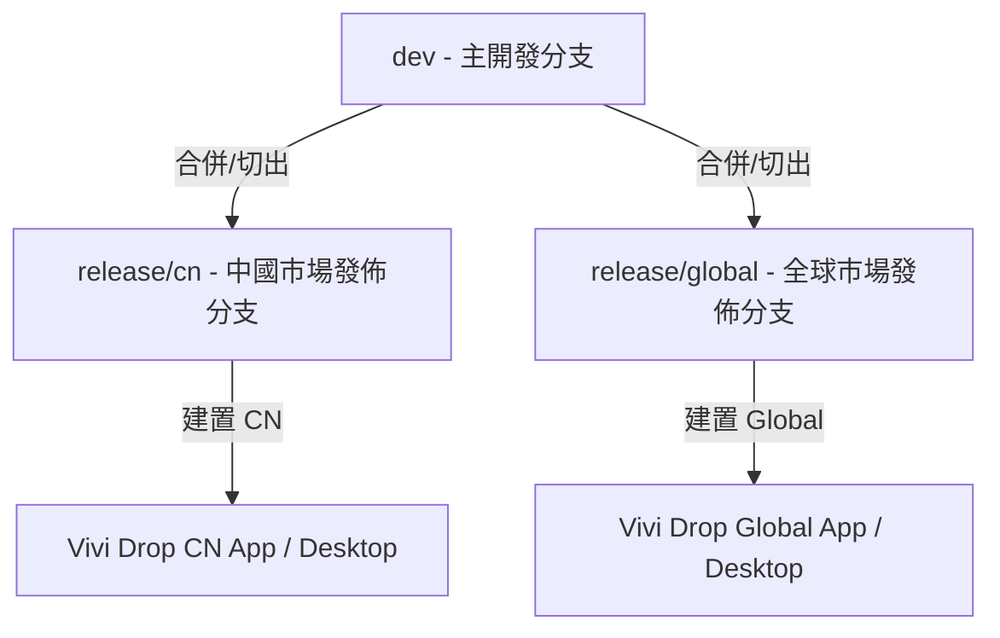
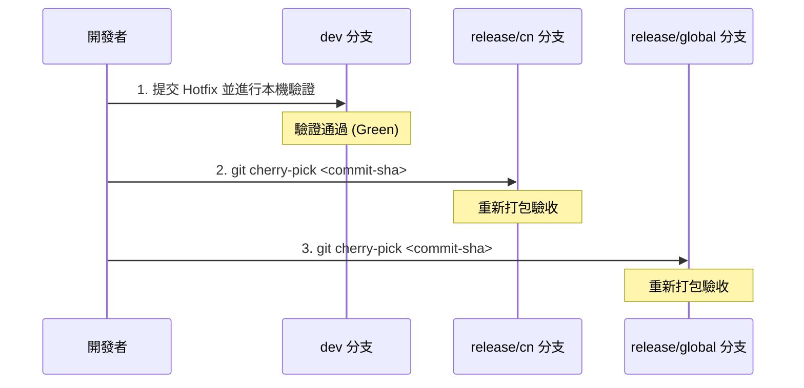

# SyncFlow 多市場發佈與熱修復流程

本文件說明 SyncFlow 中國市場（CN）與全球市場（Global）的分支管理、Tag 對齊與熱修復（Hotfix）流程。

---

## 1. 分支策略與結構

為了在一套程式碼庫中同時支援兩個市場的獨立發佈節奏，我們使用以下分支結構：



- **`dev`**：核心開發分支。所有新功能（Features）與一般 Bug 修復（Bugfixes）皆在此分支進行開發與整合。
- **`release/cn`**：中國市場的專屬發佈分支。僅包含已驗證並準備發佈至中國 App Store / Android 應用市場 / 國內官網的程式碼。
- **`release/global`**：全球市場的專屬發佈分支。僅包含準備發佈至全球 App Store / Google Play / 全球官網的程式碼（整合 Google/Apple 原生登入）。

---

## 2. 獨立市場建置指南

在各自的發佈分支上，使用對應市場的環境變數與 scheme 進行建置。

正式發佈與 Review 打包都必須使用根目錄 release profile，不要手動拼接
`SYNCFLOW_MARKET` 或 API base URL：

| Market | Production profile | Review profile  | API base URL                                                                     |
| ------ | ------------------ | --------------- | -------------------------------------------------------------------------------- |
| CN     | `cn-prod`          | `cn-review`     | prod: `https://api.vividrop.cn`, review: `https://review-api.vividrop.cn`        |
| Global | `global-prod`      | `global-review` | prod: `https://global-api.vividrop.cn`, review: `https://review-api.vividrop.cn` |

Review profile 只切換後端到 `https://review-api.vividrop.cn`，不改變市場身份：
`cn-review` 仍使用 CN app/desktop packaging，`global-review` 仍使用 Global
app/desktop packaging。

### 2.1 中國市場（CN）

- **環境變數**：`SYNCFLOW_MARKET=cn` (預設)
- **iOS 專案**：
  - Scheme: `SyncFlowMobile`
  - Configuration: `Debug` / `Release`
- **Android 專案**：
  - Build Variant: `cnDebug` / `cnRelease`
- **Desktop 專案**：
  - 封裝指令：`pnpm package:cn` (使用 `electron-builder.cn.yml`)

### 2.2 全球市場（Global）

- **環境變數**：`SYNCFLOW_MARKET=global`
- **iOS 專案**：
  - Scheme: `SyncFlowMobileGlobal`
  - Configuration: `DebugGlobal` / `ReleaseGlobal`
- **Android 專案**：
  - Build Variant: `globalDebug` / `globalRelease`
- **Desktop 專案**：
  - 封裝指令：`pnpm package:global` (使用 `electron-builder.global.yml`)

---

## 3. Tag 對齊與雙倉庫規則

發佈打包完成後，必須為對應版本打上 Git Tag。

### 3.1 Tag 格式命名

- **中國市場**：`beta/cn/v<MARKETING_VERSION>-b<CURRENT_PROJECT_VERSION>`
  _例如：`beta/cn/v0.1.0-b6`_
- **全球市場**：`beta/global/v<MARKETING_VERSION>-b<CURRENT_PROJECT_VERSION>`
  _例如：`beta/global/v0.1.0-b6`_

### 3.2 雙倉庫對齊規則（跨倉庫約束）

若打包並上傳了 iOS TestFlight，完成後**必須**在以下兩個倉庫打上完全相同的 Tag 並推送到遠端：

1. `/Volumes/T7/Dev/Web/SyncFlow`
2. `/Volumes/T7/Dev/Web/vivi-drop-server`

_請確保兩邊使用同一個 Tag 名稱，切勿只對其中一個倉庫打 Tag。_

---

## 4. 熱修復（Hotfix）流程

當線上版本（CN 或 Global）出現緊急 Bug 需要修復時，請嚴格遵守以下「**Dev 先行，Cherry-pick 後導**」的原則，以避免程式碼分叉（Code Drift）。



### 熱修復步驟：

1. **在 `dev` 分支修復**：
   開發者首先在 `dev` 分支（或自 `dev` 切出的臨時修復分支）上解決 Bug，完成測試與驗證。
2. **獲取 Commit SHA**：
   記錄該修復在 `dev` 分支合併後的 Commit SHA。
3. **揀選至發佈分支**：
   - 切換至 `release/cn` 分支，執行：
     ```bash
     git checkout release/cn
     git cherry-pick <COMMIT_SHA>
     ```
   - 切換至 `release/global` 分支，執行：
     ```bash
     git checkout release/global
     git cherry-pick <COMMIT_SHA>
     ```
4. **重新建置與發佈**：
   在各自的 release 分支上重新執行預檢與打包流程，並打上遞增 build number 的 Tag（例如從 `b6` 升至 `b7`）。

> [!WARNING]
> 嚴禁直接在 `release/cn` 或 `release/global` 分支上直接修改並提交程式碼。所有變更必須源自 `dev`，否則會導致 `dev` 丟失修復，在下一次合併時引發程式碼回退（Regression）。
