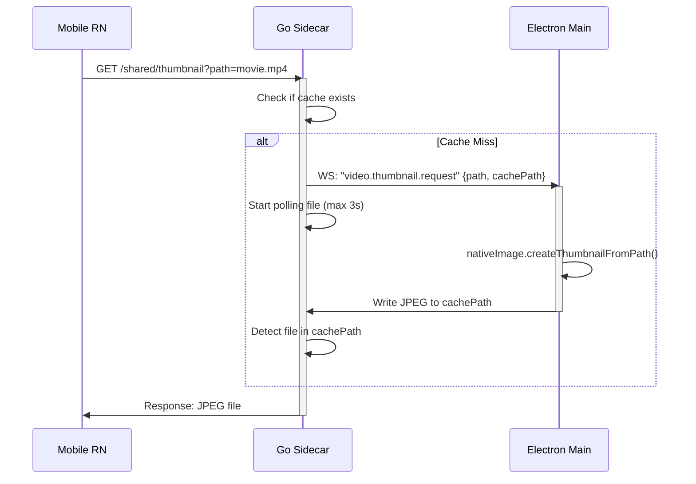

# 2026-06-22 Video Thumbnails Design Specification

## 1. Overview
The current implementation of Vivi Drop V2 displays default media icons for video files in "Recent Downloads" and "Remote Resources" on the mobile application. This specification details the architecture for Option B, which delegates video thumbnail extraction to the desktop PC (leveraging Electron's hardware-accelerated OS-native APIs) and streams the generated JPEG image to the mobile client.

## 2. Architecture & Data Flow
When a mobile device browses remote resources or lists downloaded files:
1. The **Go Sidecar** identifies video files and returns a `thumbnailUrl` pointing to its HTTP server endpoints.
2. When the mobile app requests a video thumbnail via HTTP GET:
   - Go Sidecar intercepts the request.
   - If a cached thumbnail (.jpg) exists, it is served immediately.
   - If not, Go Sidecar broadcasts a `video.thumbnail.request` event over the WebSocket stream.
3. The **Electron Main Process** receives the event via the WebSocket bridge.
   - It calls `nativeImage.createThumbnailFromPath` to generate a 256x256 thumbnail of the video file.
   - It saves the JPEG representation to the Go sidecar's directory-scoped cache directory.
4. The **Go Sidecar** polls the filesystem for the cached thumbnail (max 3 seconds) and serves it once created.
5. The **Mobile Client** displays the thumbnail using a lightweight standard `<Image>` component instead of a heavy `<Video>` component.

## 3. Specifications

### 3.1 Packages & Contracts (`@syncflow/contracts`)
* **File:** [events.ts](file:///Volumes/T7/Dev/Web/SyncFlow/packages/contracts/src/events.ts)
  - Add `VIDEO_THUMBNAIL_REQUEST` event to `SIDECAR_EVENT_TYPES` and `SidecarEvent` payload schema.

### 3.2 Go Sidecar (`services/sidecar-go`)
* **File:** [handlers_shared.go](file:///Volumes/T7/Dev/Web/SyncFlow/services/sidecar-go/internal/api/handlers_shared.go)
  - Add helper `isSupportedVideoThumbnailSource(filename)`.
  - Update `listSharedDir` and directory list mapping to return a thumbnail URL for video files.
  - In `serveCachedThumbnailForResolvedFile`:
    - Add video thumbnail generation request trigger.
    - Implement file polling loop (e.g. 100ms interval, 3 seconds max timeout) checking for file creation.
* **File:** [handlers_resources.go](file:///Volumes/T7/Dev/Web/SyncFlow/services/sidecar-go/internal/api/handlers_resources.go)
  - Support `MediaType == "video"` received files in `enrichResourcesReceivedThumbnailURLs`.
  - Support video files in received resources thumbnail route.

### 3.3 Electron Main Process (`@syncflow/desktop`)
* **File:** [ws-bridge.ts](file:///Volumes/T7/Dev/Web/SyncFlow/apps/desktop/src/main/ws-bridge.ts)
  - Listen for the `video.thumbnail.request` event in the WebSocket message reader.
  - Invoke `nativeImage.createThumbnailFromPath(videoPath, { width: 256, height: 256 })` asynchronously.
  - Save output to the computed `cachePath` as JPEG (`image.toJPEG(80)`).

### 3.4 Mobile Client (`@syncflow/mobile`)
* **File:** [RemoteAccessGlobalScreen.tsx](file:///Volumes/T7/Dev/Web/SyncFlow/apps/mobile/src/screens/RemoteAccessGlobalScreen.tsx)
  - Enable mapping and loading of `thumbnailUrl` for `video` type items.
  - Update `RemoteResourceVisual` to check for video thumbnails.
* **File:** [DownloadRecordsGlobalScreen.tsx](file:///Volumes/T7/Dev/Web/SyncFlow/apps/mobile/src/screens/DownloadRecordsGlobalScreen.tsx)
  - Update `DownloadRecordPreviewThumbnail` to check if `thumbnailUrl` is a server URL. If so, display it using `<Image>` instead of falling back to `<Video>`.

## 4. Testing & Verification
1. Run types checks and builds across all packages:
   - `pnpm build` (to compile contracts additions).
   - `pnpm typecheck`.
2. Run vitest tests for desktop main process event handling.
3. Verify directory lists returning video items contain correct `thumbnailUrl`.
