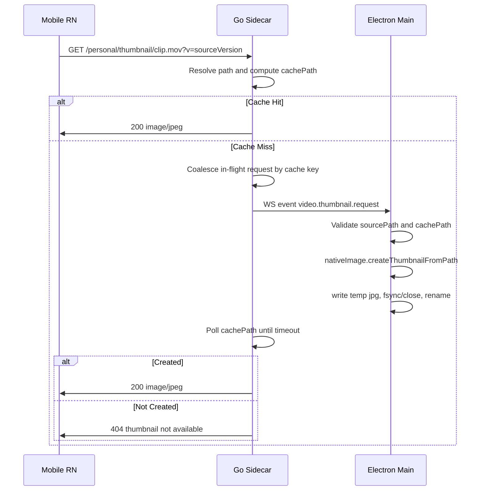

# 2026-06-22 Video Thumbnails Design Specification

## Feasibility Verdict

This plan is feasible, but it should be implemented as an asynchronous best-effort thumbnail pipeline, not as a synchronous RPC from Go to Electron.

The right product direction is to generate video posters on the desktop side and let mobile render them as normal images. The mobile list UI should never instantiate `<Video>` just to show a thumbnail. That keeps "Recent Downloads" and "Remote Resources" smooth while scrolling, reduces decoder pressure on iOS and Android, and preserves the existing sidecar HTTP access model.

The original version of this spec was directionally correct. The missing pieces were the operational contract: duplicate request coalescing, path validation, atomic cache writes, explicit fallback behavior, DTO propagation, and tests across sidecar, desktop main, and mobile.

## Goals

- Show real video thumbnails in mobile "Recent Downloads" and "Remote Resources" when the desktop can generate a poster.
- Generate posters on the desktop process using Electron `nativeImage.createThumbnailFromPath`.
- Serve generated posters through the existing sidecar HTTP thumbnail URLs.
- Keep list rendering cheap on mobile by using `<Image>` for thumbnails and icon fallback on errors.
- Avoid changing queue semantics, sync state machine behavior, resource ownership, or persistence rules outside thumbnail metadata.

## Non-Goals

- Do not generate video thumbnails on mobile.
- Do not use `<Video>` as a list thumbnail fallback.
- Do not introduce manual thumbnail refresh controls.
- Do not block directory listing or recent-download list rendering while thumbnails are generated.
- Do not add a new long-lived RPC channel. Reuse the existing sidecar event stream as a request signal.

## User Experience

1. The mobile list receives `thumbnailUrl` for supported video files.
2. The first render may briefly show the existing video icon if the thumbnail cache is cold or generation fails.
3. Once the thumbnail URL returns an image successfully, the item displays the poster with a small video/play affordance if the existing UI pattern supports it.
4. Failed thumbnail image loads fall back to the current file-type icon without retry loops in the rendered cell.
5. Full preview and playback still use `streamUrl`/`previewUrl`; thumbnail loading does not change media playback behavior.

## Architecture

The Go sidecar owns HTTP endpoints, path resolution, cache keys, and cache serving. Electron main owns video frame extraction because Electron has access to OS-native media thumbnail APIs. Mobile remains a pure consumer of `thumbnailUrl` and `streamUrl`.



Important behavior: the WebSocket event is only a signal. It does not return a response to sidecar. Sidecar detects success by observing the cache file.

## Data Contracts

### `@syncflow/contracts`

Modify `packages/contracts/src/events.ts`.

Add a new dot-notation event constant:

```ts
VIDEO_THUMBNAIL_REQUEST: 'video.thumbnail.request',
```

Add a typed event to `SidecarEvent`:

```ts
| {
    type: typeof SIDECAR_EVENT_TYPES.VIDEO_THUMBNAIL_REQUEST;
    payload: {
      requestId: string;
      sourcePath: string;
      cachePath: string;
      sourceVersion: string;
      maxEdge: number;
      quality: number;
    };
  }
```

Notes:

- `requestId` is for log correlation only. Sidecar must not wait for a response with the same ID.
- `sourcePath` and `cachePath` are absolute local paths produced by sidecar after it resolves the requested resource.
- `sourceVersion` must match the same size/modtime/cache-version input used to compute the cache key.
- `maxEdge` should start at `256`.
- `quality` should start at `80`.
- Event naming must remain dot-notation.

`DirectoryFileDTO` already has `thumbnailUrl?: string` and `streamUrl?: string`. The implementation must use those existing fields rather than adding duplicate DTOs.

## Sidecar Design

### Directory Listing

Modify `services/sidecar-go/internal/api/handlers_shared.go` and personal directory handling that reuses `listDirectory`.

Current `directoryFileDTO` is missing `StreamURL` even though `DirectoryFileDTO` in contracts has `streamUrl`. Add:

```go
StreamURL *string `json:"streamUrl,omitempty"`
```

For non-directory video files:

- Return `streamUrl` pointing to `/shared/stream/{path...}` or `/personal/stream/{path...}`.
- Return `thumbnailUrl` pointing to `/shared/thumbnail/{path...}?v=<sourceVersion>` or `/personal/thumbnail/{path...}?v=<sourceVersion>` when the extension is supported for video poster generation.
- Do not create cache files during listing.

For image files:

- Preserve existing image thumbnail behavior.
- Keep versioned personal thumbnail URLs.

For directories and unsupported media:

- Omit `thumbnailUrl`.
- Omit `streamUrl`.

Supported video thumbnail source extensions should be explicit and conservative at first:

```go
.mp4, .mov, .m4v, .webm
```

`classifyFileType` can continue to classify additional video extensions for icons and streaming, but poster generation should only advertise formats Electron is likely to handle consistently.

### Thumbnail Endpoint

Extend `serveCachedThumbnailForResolvedFile` so it handles two thumbnail source families:

- Supported images: existing Go resize/cache path.
- Supported videos: Electron-generated cache path.

For videos:

1. Resolve and validate the requested path using the existing scope resolver before any event is emitted.
2. Compute `cachePath` with the existing `directoryThumbnailCachePath` mechanism, including `directoryThumbnailCacheVersion`.
3. If cache exists, serve it immediately with `Content-Type: image/jpeg`.
4. If cache is missing, acquire a thumbnail slot and an in-flight guard keyed by `cachePath`.
5. The first request for that `cachePath` broadcasts `video.thumbnail.request`.
6. All concurrent requests for the same `cachePath` wait for the same filesystem result instead of broadcasting duplicate events.
7. Poll for cache creation for up to 3 seconds, with a 100ms interval.
8. On success, prune thumbnail cache and serve JPEG.
9. On timeout, Electron disconnected, unsupported codec, empty thumbnail, or write failure, return `404`.

The endpoint must not return `500` for normal media thumbnail failures. A missing video poster is a capability/fallback case, not a server failure.

### In-Flight Guard

Add a small sidecar-level coordinator, for example:

```go
type videoThumbnailInflight struct {
  done chan struct{}
}
```

Store it on `Server` behind a mutex:

```go
videoThumbnailMu       sync.Mutex
videoThumbnailInflight map[string]*videoThumbnailInflight
```

Expected behavior:

- First request creates the entry, broadcasts the event, waits for cache file or timeout, then closes `done` and removes the entry.
- Later requests for the same `cachePath` wait on `done` or their request context, then check whether the cache file exists.
- Request cancellation must not leak map entries.

### Event Broadcast

Broadcast through the existing `events.Hub`:

```go
s.hub.Broadcast(events.Event{
  Type: "video.thumbnail.request",
  Payload: map[string]any{
    "requestId": requestID,
    "sourcePath": resolved,
    "cachePath": cachePath,
    "sourceVersion": directoryThumbnailSourceVersion(info),
    "maxEdge": directoryThumbnailMaxEdge,
    "quality": directoryThumbnailJPEGQuality,
  },
})
```

If `s.hub.ClientCount() == 0`, sidecar may still follow the same timeout path and return `404`, but it should log at debug/warn level rather than treating it as an internal error.

## Electron Main Design

Do not put thumbnail extraction directly inside `WsBridge`. `WsBridge` should remain responsible for connecting to sidecar events, parsing messages, forwarding them to renderer, and invoking the main-process event callback.

Add a focused main-process module, for example:

- `apps/desktop/src/main/video-thumbnail-generator.ts`

Responsibilities:

- Accept `SidecarEvent`.
- Ignore all events except `video.thumbnail.request`.
- Validate payload shape at runtime before touching the filesystem.
- Validate `sourcePath`:
  - absolute path
  - supported video extension
  - exists and is a regular file
- Validate `cachePath`:
  - absolute path
  - `.jpg` extension
  - parent path is under the expected sidecar thumbnail cache root
  - no path traversal after `path.resolve`
- Create the cache directory if needed.
- Generate thumbnail with:

```ts
const image = await nativeImage.createThumbnailFromPath(sourcePath, {
  width: maxEdge,
  height: maxEdge,
});
```

- Treat an empty `NativeImage` as failure.
- Convert to JPEG with the requested quality, clamped to a safe range such as `1...100`.
- Write to a temp file in the same directory as `cachePath`.
- Rename the temp file to `cachePath` only after the write completes.
- Remove temp files after failures.
- Log success/failure with `requestId`, but never throw back into the WebSocket callback.

Wire it in `apps/desktop/src/main/index.ts` by composing event handlers:

```ts
const handleVideoThumbnailEvent = createVideoThumbnailEventHandler();
wsBridge = new WsBridge(
  () => mainWindow,
  (event) => {
    powerSaveCoordinator?.handleSidecarEvent(event);
    void handleVideoThumbnailEvent(event);
  },
);
```

### Cache Path Validation Detail

Electron must not blindly trust `cachePath`. The best implementation is to derive or configure the allowed cache root from the same desktop/sidecar runtime data used to launch sidecar, then require:

```ts
path.resolve(cachePath).startsWith(path.resolve(cacheRoot) + path.sep)
```

If that cache root is not currently available in desktop main, add the smallest explicit helper to expose it from existing sidecar runtime/config code. Do not allow arbitrary event payloads to write outside sidecar's thumbnail cache directory.

## Mobile Design

### Remote Resources

Modify:

- `apps/mobile/src/services/desktop-local-service.ts`
- `apps/mobile/src/screens/RemoteAccessGlobalScreen.tsx`

Behavior:

- `directoryFileToSharedResource` should preserve `thumbnailUrl` and `streamUrl` for video files, not only images.
- `personalDirectoryFileToSharedResource` should use the same preview URL normalization logic as shared directory resources.
- `RemoteResourceVisual` should render an `<Image>` when a non-empty `thumbnailUrl` exists for image or video items.
- `RemoteResourceVisual` should fall back to `RemoteResourceTypeIcon` on image load error.
- Video playback preview should continue using `streamUrl`/`previewUrl`.

### Recent Downloads

Modify:

- `apps/mobile/src/screens/DownloadRecordsGlobalScreen.tsx`
- `apps/mobile/src/screens/components/GlobalSyncActivityHomeSections.tsx` if the home recent-download card shares the same thumbnail source logic.
- `apps/mobile/src/services/download-records-service.ts` only if persistence misses any of `thumbnailUrl`, `previewUrl`, or `streamUrl`.

Behavior:

- If `thumbnailUrl` exists, render it with `<Image>`.
- If video `thumbnailUrl` is absent or fails, show the video icon fallback.
- Do not render `<Video>` inside list cells.
- Keep full-screen video preview/playback unchanged.

## Error Handling And Fallbacks

- Cold cache: first request may return `404` if generation takes too long. Mobile keeps icon fallback. Later loads can succeed once cache exists.
- Electron not connected: sidecar returns `404`; mobile shows icon.
- Unsupported codec or OS thumbnail failure: sidecar returns `404`; mobile shows icon.
- Corrupt or zero-byte cache file: sidecar should ignore/delete it and return `404`.
- Concurrent requests: only one event per `cachePath` should be emitted during the in-flight window.
- Cache eviction: reuse existing `thumbnail-cache` pruning limits.

## Security Constraints

- Sidecar must resolve source file paths with existing shared/personal/received resolvers before broadcasting.
- Electron must validate `sourcePath` and `cachePath` independently before reading or writing.
- Electron must write only inside the sidecar thumbnail cache root.
- The renderer must not access sidecar, filesystem, or SQLite directly.
- DTO types must come from `@syncflow/contracts`.
- Do not introduce unauthenticated filesystem write routes.

## Testing Plan

### Contracts

- Typecheck confirms `SIDECAR_EVENT_TYPES.VIDEO_THUMBNAIL_REQUEST` is available and `SidecarEvent` narrows correctly.

### Sidecar Go Tests

Add or extend tests near `services/sidecar-go/internal/api/router_test.go` and resource handler tests:

- Directory list returns versioned `thumbnailUrl` and `streamUrl` for supported video files.
- Directory list omits `thumbnailUrl` for unsupported video poster formats while still classifying them as video.
- Video thumbnail endpoint emits exactly one `video.thumbnail.request` event for concurrent cache misses with the same cache key.
- Video thumbnail endpoint serves a JPEG when the expected cache file appears before timeout.
- Video thumbnail endpoint returns `404` when no Electron client creates the cache file.
- Existing image thumbnail tests still pass.

### Desktop Vitest

Add tests for `video-thumbnail-generator`:

- Ignores non-thumbnail sidecar events.
- Rejects malformed payloads.
- Rejects non-absolute `sourcePath` or `cachePath`.
- Rejects cache paths outside the allowed thumbnail cache root.
- Calls `nativeImage.createThumbnailFromPath` with `{ width: 256, height: 256 }`.
- Writes JPEG bytes to a temp file and renames to final cache path.
- Removes temp file when thumbnail generation fails.

### Mobile Tests

Add or update tests:

- `desktop-local-service.test.ts`: video directory files preserve `thumbnailUrl`, `streamUrl`, and `previewUrl`.
- `RemoteAccessGlobalScreen` tests: video item with `thumbnailUrl` renders `<Image>` and falls back to icon on error.
- Recent download tests: video record with `thumbnailUrl` renders image thumbnail; video record without `thumbnailUrl` does not render `<Video>` in list cells.

### Verification Commands

Run targeted checks first:

```bash
(cd services/sidecar-go && go test ./internal/api ./internal/events)
pnpm --filter @syncflow/desktop test -- video-thumbnail-generator ws-bridge
pnpm --filter @syncflow/mobile test -- desktop-local-service RemoteAccessGlobalScreen GlobalSyncActivityHomeSections
pnpm --filter @syncflow/mobile exec tsc --noEmit
```

Then run broader checks when the branch is ready:

```bash
pnpm build
pnpm typecheck
pnpm test
```

## Implementation Order

1. Update `@syncflow/contracts` event typing.
2. Add sidecar DTO propagation for `streamUrl` and video `thumbnailUrl`.
3. Add sidecar video thumbnail cache miss flow with in-flight coalescing and event broadcast.
4. Add Electron main video thumbnail generator and wire it into the existing `WsBridge` callback.
5. Update mobile service mapping and list thumbnail rendering.
6. Remove `<Video>` thumbnail fallback from mobile list cells.
7. Run targeted tests and then full checks.

## Open Implementation Notes

- The first implementation should prefer reliability over format breadth. Start with `.mp4`, `.mov`, `.m4v`, and `.webm`; add more extensions only after manual verification on both supported desktop platforms.
- If desktop main currently cannot derive sidecar's thumbnail cache root safely, add that support before enabling writes. Do not weaken cache path validation to ship faster.
- The sidecar should keep returning normal file metadata even when thumbnail generation is unavailable.
- This work should not alter transfer queue ordering, upload concurrency, sync status transitions, or access-record semantics except for preserving thumbnail/stream URLs in existing download/resource records.
