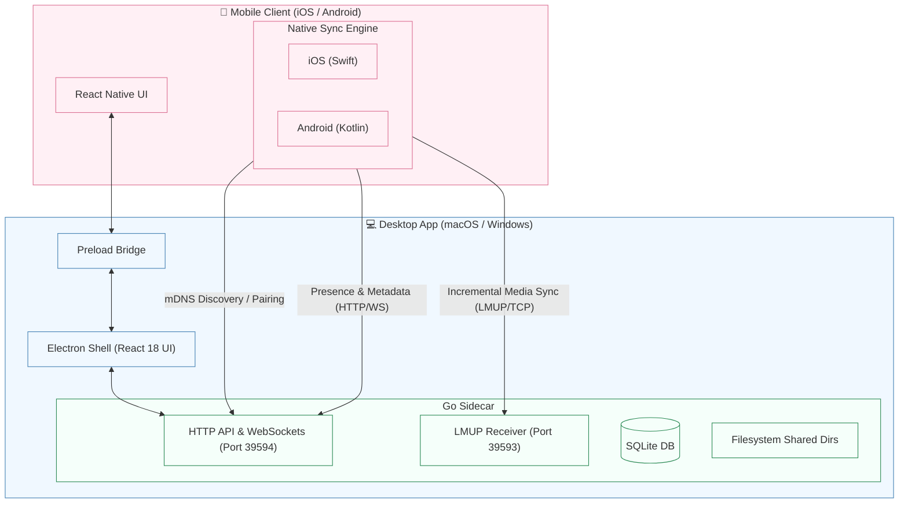

# README Beautification & Modernization Spec

This document outlines the design and plan for beautifying `README.md` and `README.zh-Hant.md` to present a modern, premium layout, clear technical information, and a high-fidelity Mermaid.js architecture diagram.

## Goals

1. **Modern Layout**: Enhance typography, use uniform badges, and structure sections using clear visual hierarchies.
2. **Interactive Diagrams**: Replace the text-based ASCII diagram with a dynamic Mermaid.js flowchart mapping mobile-desktop relationships and communications.
3. **Structured Collapse**: Wrap long logs, folder structures, and developer commands in `
` blocks to keep the page clean and scannable.
4. **Bilingual Sync**: Fully align `README.md` (English) and `README.zh-Hant.md` (Traditional Chinese) in terms of structure and updates.

## Technical Details

### 1. Badges & Header

- Align the headers, logos, and badges at the top center.
- Use uniform flat-square style shields for all badges:
  - OSS Release Gate: `https://github.com/lynavo/lynavo-drive/actions/workflows/oss-release-gate.yml/badge.svg`
  - Node.js: `>= 22.12.0` (green/blue logo)
  - Go: `>= 1.25.6` (00ADD8 logo)
  - Platform: macOS | Windows (lightgrey)
  - Mobile: iOS | Android (lightgrey)
  - License: MIT (green)

### 2. Architecture Diagram (Mermaid)

Replace ASCII with:

### 3. OSS Boundaries

Format the open-source gates using GitHub Alerts:

- `[!IMPORTANT]` for Local-LAN open-source core details.
- `[!WARNING]` for out-of-scope non-OSS boundaries (such as remote connection, cloud relay, store distribution, etc.).

### 4. Technical Infrastructure Section

Group the following sub-headings under a single unified section:

- **Prerequisites**
- **Tech Stack**
- **Common Commands**
- **Project Structure**
- **OSS Build & Package Verification**
  Fold long listings (like commands, package verification, folder map) inside `
` blocks.

### 5. Community & Social Shields

- Replace text links in the "Community & Social" (or "社群與社群媒體") section with modern flat-square brand badges:
  - X: ``
  - Mastodon: ``
  - Bluesky: ``
  - LinkedIn: ``
  - YouTube: ``

### 6. License Removal

- Note that the "License" and "授權條款" sections have been explicitly removed.

## Execution Checklist

- [ ] Update `README.md` (English only, no Chinese) to add community shields and ensure no License section.
- [ ] Update `README.zh-Hant.md` (Traditional Chinese only) to add community shields and ensure no License section.
- [ ] Verify formatting and markdown structure in both files.
- [ ] Run `pnpm format:check` to ensure no linting/formatting regression.
