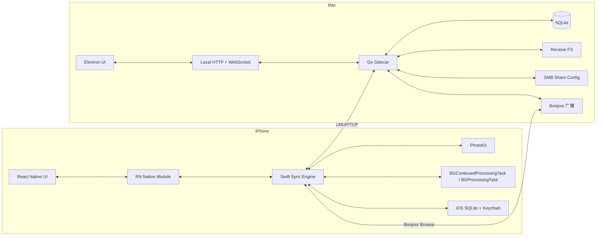
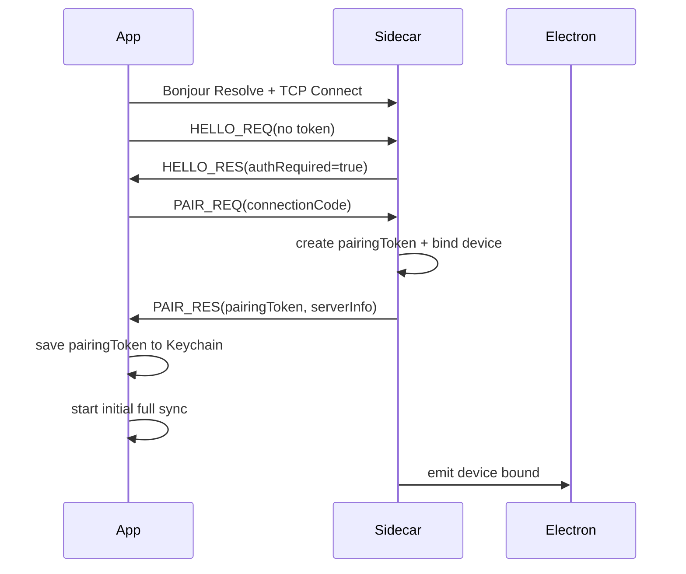

# SyncFlow：局域网素材无感同步工具 V2 技术设计文档（Code Agent 实现版）

版本：v2.0  
日期：2026-03-20  
状态：可直接作为开发实现规格  
适用对象：Code Agent / macOS Desktop 开发 / Go Sidecar 开发 / iOS Native 开发 / RN 开发

---

## 0. 这版文档先读

本版文档基于上一版技术方案、你提供的 PRD，以及当前 UI 逻辑重新收敛，**有两个关键修正**：

1. **iPhone 退到后台后持续长时间上传** 现在是硬性目标。  
2. **PC 端文件夹共享（局域网）** 现在是硬性目标。  

因此，本版方案不再沿用“前台上传即可”的实现边界，而是明确给出可交付的工程方案。

### 0.1 最终架构决策

- PC：`Electron + Go sidecar`
- App：`React Native + Swift 原生同步引擎`
- 设备发现：`Bonjour / mDNS`
- 鉴权：`6 位连接码首次绑定 + 长期配对令牌`
- 传输：`自定义 TCP（单连接、单文件串行）`
- 文件共享：`SMB 共享（Mac 端）`
- 背景执行：
  - **持续长时间上传：依赖 iOS 26+ 的 BGContinuedProcessingTask**
  - **周期性后台增量扫描：依赖 BGProcessingTaskRequest**
  - **前后台切换桥接：使用 UIApplication background task**

### 0.2 重要前提

为了同时满足 **“自定义 TCP”** 和 **“iPhone 退后台后持续长时间上传”**，**iOS 端最低系统版本必须定为 iOS 26.0+**。

如果后续业务要求必须支持 iOS 25 及以下，那么当前“自定义 TCP 数据面”必须改为 `URLSession background session` 的 HTTP/HTTPS 上传；那会是另一套传输设计，不属于本版文档范围。

### 0.3 文件夹共享的实现边界

Mac 端“文件夹共享”支持的定义是：

- 应用内配置接收目录
- 生成并展示局域网共享地址
- 校验共享是否配置完成
- 提供“打开文件夹 / 复制共享地址 / 系统引导”
- **优先采用“系统手动开启 + 应用验证”的正式方案**
- “自动化替用户开 SMB 共享”仅允许作为**内部版增强能力**，不作为发布版硬依赖

原因很简单：系统级文件共享属于 macOS 全局设置，本方案不依赖私有 API，也不把自动改系统设置当成可发布的主路径。

---

## 1. 产品目标与硬性业务规则

### 1.1 产品目标

构建一个 **iPhone -> Mac 局域网素材无感增量同步工具**，面向短视频团队的大量图片/视频素材同步场景。

### 1.2 硬性业务规则

1. 用户在 App 内搜索局域网可用 PC。
2. 列表展示：`设备名称 / IP / 类型(mac|win)`。
3. 用户点击目标设备后输入 **6 位连接码**。
4. 第 6 位输入完成后，**自动校验**，无确认按钮。
5. 首次绑定成功后，App 与该 PC 建立**长期配对关系**。
6. 后续同步默认 **全自动增量同步**：
   - 扫描照片库全部图片/视频
   - 只上传新增或未完成的素材
   - 严禁重复上传
7. **同一台手机同一时间只允许 1 个文件处于上传中**。
8. 移动端队列 **绝对只读**：
   - 不支持手动删队列
   - 不支持调整顺序
   - 不支持逐个跳过
9. App 退到后台或锁屏后，必须尽可能持续长时间上传。
10. PC 看板以 **Grid/Card** 方式展示任意数量设备。
11. PC 端需要提供局域网共享目录能力，便于其他电脑访问接收到的素材。
12. 剩余空间低于 `500 MB` 时，PC 端暂停接收并告警。

### 1.3 v2 范围

#### 本期范围

- iPhone 单目标 PC 绑定
- Bonjour 发现
- 6 位连接码首次绑定
- 长期配对令牌
- 自定义 TCP 串行传输
- 当前文件断点续传（按 offset）
- 全自动增量扫描
- 背景持续同步
- 移动端按天历史汇总
- PC Dashboard + 设备详情弹窗
- Mac 文件夹共享配置、展示、验证与引导

#### 本期非目标

- Android 发送端
- Windows 正式接收端
- 多 PC 同时绑定
- 多文件并发上传
- 用户手动勾选文件
- 传输链路端到端加密
- 云端账号体系
- 素材删除同步
- 素材转码
- App 内在线播放器
- 自动化修改 macOS 系统 SMB 设置作为唯一主路径

---

## 2. 平台与版本前提

### 2.1 Desktop

- 平台：macOS
- UI：Electron
- 本地服务：Go sidecar
- 本地存储：SQLite + 文件系统
- 局域网发现广播：Bonjour / mDNS
- 局域网共享：SMB

### 2.2 Mobile

- 平台：iPhone
- UI：React Native
- 同步引擎：Swift
- 照片访问：PhotoKit
- 发现/连接：Bonjour + Network.framework
- 背景执行：
  - `BGContinuedProcessingTask`：持续后台同步
  - `BGProcessingTaskRequest`：周期性后台增量扫描
  - `UIApplication.beginBackgroundTask`：前后台切换桥接

### 2.3 版本限制

- iOS：**26.0+**
- React Native：使用 New Architecture 不是硬性要求，但原生同步引擎必须完全独立于 JS 层
- Electron：版本不限，要求支持 sidecar 子进程管理
- Go：`1.23+`
- SQLite：`3.40+`

---

## 3. 总体架构



### 3.1 职责划分

#### React Native

只负责：

- 页面渲染
- 状态展示
- 连接码输入
- 历史记录列表
- 绑定设备设置
- 接收原生事件

#### Swift Sync Engine

负责：

- Bonjour 浏览
- 配对/自动认证
- 后台任务注册与执行
- 增量扫描
- 资源导出
- 自定义 TCP 协议
- 串行上传
- 断点续传
- 本地状态持久化

#### Electron

负责：

- 首页 Dashboard
- 设备卡片
- 设备详情弹窗
- 设置页
- 连接码管理
- 共享地址展示
- 系统引导
- sidecar 生命周期管理

#### Go sidecar

负责：

- Bonjour 广播
- TCP 监听与协议解析
- 首次绑定 / 长期令牌校验
- 文件接收与落盘
- 断点续传
- 日统计与历史台账
- 共享路径配置与状态检测
- 供 Electron 调用的本地 API

---

## 4. 与上一版相比的关键设计变化

### 4.1 认证模型由“短会话令牌”改为“长期配对令牌”

原因：产品现在要求 **首次绑定后自动后台增量同步**。  
如果只保留 30 分钟短 token，用户第二天后台同步就会失效。

#### 最终方案

- **连接码**：仅用于首次绑定或重新绑定
- **配对令牌 pairingToken**：长期有效，存 iPhone Keychain，Sidecar 存 token hash
- **同步会话 sessionId**：每次同步生成，用于当前会话恢复

### 4.2 App 默认行为改为“绑定后自动同步”

- 第一次安装且未绑定：默认页是“搜索设备页”
- 已绑定后：默认页是“同步动态页”
- App 启动、进入前台、网络切换到 Wi‑Fi、系统给出后台任务窗口时，都会尝试做增量同步

### 4.3 传输仍是自定义 TCP，但必须配合持续后台任务

本版文档没有改掉自定义 TCP，但为了让它在后台继续跑，必须把 iOS 最低版本抬到 26+。

### 4.4 PC 端加入“共享路径”能力

设置页新增：

- 接收地址
- 共享地址（局域网）
- 共享状态
- 系统引导

---

## 5. 发现协议设计（Bonjour / mDNS）

### 5.1 服务类型

固定使用：

```text
_syncflow._tcp
```

### 5.2 sidecar 广播信息

- instance name：`<deviceDisplayName>`
- listen port：`39393`
- TXT record：

| key | 示例 | 说明 |
|---|---|---|
| `id` | `mac-7fae12c9` | 服务端唯一 ID |
| `name` | `剪辑工作站-A` | 显示名 |
| `type` | `mac` | 设备类型，保留 `win` 扩展 |
| `proto` | `2` | 协议版本 |
| `auth` | `code` | 首次绑定方式 |
| `share` | `1` | 是否开启共享能力 |
| `shareName` | `SyncFlow` | SMB 共享名 |
| `app` | `desktop` | 角色标识 |

### 5.3 App 侧发现结果模型

```ts
export interface DiscoveredDevice {
  deviceId: string
  name: string
  type: 'mac' | 'win'
  ip: string
  port: number
  protoVersion: number
  authMode: 'code'
  shareEnabled: boolean
  shareName?: string
  lastSeenAt: string
}
```

### 5.4 发现流程

1. App 进入搜索页，启动 Bonjour Browse
2. 聚合 1 秒内发现结果后刷新列表
3. 设备按 `deviceId` 去重
4. 10 秒未再次看到则标记离线
5. UI 显示：
   - 设备名
   - IP
   - 类型（Mac / Win）
6. 点击设备进入“连接码输入页”

### 5.5 设备排序

搜索页排序：

1. 最近已绑定设备
2. 当前在线设备
3. 最近见过但已离线设备

---

## 6. 绑定、认证与会话设计

### 6.1 连接码

- 6 位数字
- Electron 设置页可复制 / 重新生成
- 第 6 位输入完成后自动触发验证
- 输入错误：
  - 清空 6 格
  - 震动提示
  - 保留当前设备上下文

### 6.2 认证分两层

#### 首次绑定

- 用户输入连接码
- App 发 `PAIR_REQ`
- Sidecar 校验通过后：
  - 生成 `pairingId`
  - 生成 `pairingToken`
  - 记录这台 iPhone 的 `clientId`
- App 将 `pairingToken` 存到 Keychain

#### 后续自动同步

- App 不再输入连接码
- 直接在 `HELLO_REQ` 中附带 `pairingToken`
- Sidecar 校验 token hash
- 校验通过后建立同步会话

### 6.3 令牌模型

#### clientId

- iPhone 首次安装时生成 UUID
- 存 Keychain
- 代表当前手机实例

#### pairingToken

- 长期凭证
- 只在首次绑定成功时下发
- 存 Keychain
- Sidecar 只存 hash，不存明文

#### sessionId

- 每次同步任务启动时生成
- 用于当前同步会话与恢复

### 6.4 一台 iPhone 只允许绑定一个目标 PC

这是当前产品边界，和移动端设置页 UI 一致：

- 已绑定时默认不再显示“搜索设备”
- 设置页支持“断开连接 / 切换设备”
- 切换设备会清掉当前绑定关系，但保留历史记录

---

## 7. 同步生命周期

### 7.1 首次绑定后的完整流程



### 7.2 后续自动同步生命周期

触发器：

- App 启动
- App 回到前台
- Wi‑Fi 可用且发现到已绑定目标设备
- 系统调度的后台任务触发
- 当前同步未完成且恢复条件满足

执行步骤：

1. 校验照片权限
2. 校验绑定关系与 pairingToken
3. 发现目标设备
4. TCP 建连
5. 增量扫描素材
6. 生成本次静态队列快照
7. 串行上传全部待传文件
8. 更新当日日志、历史汇总、PC 看板
9. 若中断则记录恢复点
10. 下次自动恢复

### 7.3 队列规则

- 一次同步会话只维护一个有序队列
- 同一时刻仅 1 个文件处于 uploading
- 队列只读
- 不允许用户在 UI 层：
  - 删除任务
  - 调整顺序
  - 跳过任务
- 允许的用户动作只有：
  - 断开绑定
  - 切换设备

---

## 8. iPhone 后台持续上传设计

### 8.1 目标

在以下场景下尽可能持续同步：

- App 退到后台
- 锁屏
- 短暂切换应用
- 网络波动后恢复
- 系统给出后台执行窗口

### 8.2 三层后台执行策略

#### 第一层：前后台切换桥接

当用户从前台切到后台时，立即申请：

- `UIApplication.beginBackgroundTask`

用途：

- 给当前文件发送状态收尾
- 给持续后台任务切换留缓冲时间
- 避免刚切后台就被立即挂起

#### 第二层：持续后台执行

同步任务在前台开始后，立即创建：

- `BGContinuedProcessingTask`

用途：

- 承载“用户已经发起且仍可感知”的长时间同步工作
- App 进入后台后继续保持同步引擎运行
- 同一条 TCP 连接允许继续传当前文件，并继续后续队列

#### 第三层：周期性后台维护

注册：

- `BGProcessingTaskRequest`

用途：

- 在系统允许时做“增量扫描 + 自动接续”
- 当用户未主动打开 App 但系统给到后台窗口时，尝试继续同步
- 这是“无感增量同步”的补充机制，不是精确定时器

### 8.3 关键限制

1. **不承诺绝对实时触发**
   - 周期性后台扫描是系统调度，时间不可精确约束
2. **不承诺被用户强制杀掉后继续**
   - 若用户从 App Switcher 明确划掉应用，本期不保证继续后台同步
3. **iOS 上没有 Android 那种常驻通知栏**
   - 本期不设计“常驻通知栏”
   - 如需可见反馈，可后续补 Live Activity，但不是本版硬性范围

### 8.4 背景状态机

```text
idle
discovering
scanning
preparing
syncing_foreground
syncing_background
backoff_waiting
paused_no_target
paused_no_permission
stopped
```

状态切换规则：

- 前台启动同步 -> `syncing_foreground`
- 用户切后台且 continued task 生效 -> `syncing_background`
- 网络断开 -> `backoff_waiting`
- 找不到目标设备 -> `paused_no_target`
- continued task 到期 -> 记录恢复点并进入 `paused_no_target` 或 `backoff_waiting`

### 8.5 背景中断恢复

恢复点只记录 **当前文件**：

- `sessionId`
- `fileKey`
- `ackedOffset`
- `tempFilePath`
- `queueCursor`
- `activeTransmissionAccumulatedMs`

恢复流程：

1. App 再次拿到执行机会
2. 重新发现已绑定目标设备
3. 发送 `HELLO_REQ(pairingToken, previousSessionId)`
4. Sidecar 返回 `resumeOffset`
5. 客户端从 `resumeOffset` 继续发送当前文件
6. 当前文件完成后继续队列后续文件

---

## 9. 增量扫描与媒体导出

### 9.1 扫描范围

默认扫描当前可访问的全部：

- 图片
- 视频

来源：

- iPhone Photos Library

### 9.2 权限策略

- 请求 `PHAccessLevel.readWrite`
- 若用户授予 Limited Library：
  - 只同步可见素材
  - UI 明确提示“当前仅同步已授权部分素材”

### 9.3 增量识别策略

以 `asset_local_id + last_modified_at + resource_size` 为基础，再结合 `fileKey` 做最终去重。

#### fileKey 计算

```text
SHA256(
  clientId + "|" +
  assetLocalIdentifier + "|" +
  originalFilename + "|" +
  resourceSize + "|" +
  modifiedAt + "|" +
  mediaType
)
```

### 9.4 增量扫描算法

#### 初次绑定

- 全量扫描可见图片/视频
- 按 `creationDate desc` 生成候选队列
- 对每个候选项检查本地表是否已完成上传
- 未完成项进入队列

#### 后续同步

- 优先扫描最近更新资产
- 用 `assetLocalIdentifier + modifiedAt` 快速排除已完成素材
- 对未命中的项计算 `fileKey`
- 只把新增或失败未完成项加入队列

### 9.5 导出策略

**逐个导出、逐个上传、逐个删除临时文件**

流程：

1. 从 `PHAsset` 找到实际 `PHAssetResource`
2. 导出到 App 临时目录
3. 得到：
   - originalFilename
   - size
   - mimeType
   - createdAt
4. 上传成功 / 跳过 / 失败后清理临时文件

### 9.6 iCloud 资源

- `PHAssetResourceRequestOptions.isNetworkAccessAllowed = true`
- UI 阶段区分：
  - `preparing`：正在从 iCloud 准备文件
  - `uploading`：正在传输到 PC

---

## 10. 传输协议设计（LMUP/2）

### 10.1 总原则

- 单 TCP 连接
- 单文件串行
- 不做多文件并发
- 不做多连接
- 当前文件按 offset 恢复
- 控制帧 JSON，数据帧二进制

### 10.2 基础信息

- 协议名：`LMUP/2`
- 端口：`39393`
- 字节序：大端
- Header：

```c
struct FrameHeader {
  char     magic[4];   // "LMUP"
  uint16   version;    // 2
  uint16   type;       // MessageType
  uint32   length;     // body length
}
```

### 10.3 MessageType

| 值 | 名称 |
|---|---|
| `0x0001` | `HELLO_REQ` |
| `0x0002` | `HELLO_RES` |
| `0x0003` | `PAIR_REQ` |
| `0x0004` | `PAIR_RES` |
| `0x0005` | `SYNC_BEGIN_REQ` |
| `0x0006` | `SYNC_BEGIN_RES` |
| `0x0007` | `FILE_INIT_REQ` |
| `0x0008` | `FILE_INIT_RES` |
| `0x0009` | `FILE_DATA` |
| `0x000A` | `FILE_ACK` |
| `0x000B` | `FILE_END_REQ` |
| `0x000C` | `FILE_END_RES` |
| `0x000D` | `SYNC_END_REQ` |
| `0x000E` | `SYNC_END_RES` |
| `0x000F` | `PING` |
| `0x0010` | `PONG` |
| `0x0011` | `ERROR` |

### 10.4 HELLO_REQ

```json
{
  "clientId": "ios-uuid",
  "clientName": "iPhone 15 Pro",
  "clientPlatform": "ios",
  "appVersion": "1.0.0",
  "pairingToken": "optional",
  "previousSessionId": "optional",
  "appState": "foreground|background"
}
```

### 10.5 HELLO_RES

```json
{
  "serverId": "mac-uuid",
  "serverName": "剪辑工作站-A",
  "serverType": "mac",
  "protoVersion": 2,
  "authRequired": false,
  "bound": true,
  "resume": {
    "accepted": true,
    "sessionId": "session-uuid",
    "activeFileKey": "optional",
    "resumeOffset": 8388608
  },
  "serverCapabilities": {
    "shareEnabled": true,
    "shareName": "SyncFlow",
    "lowDiskPauseEnabled": true
  }
}
```

### 10.6 PAIR_REQ

```json
{
  "clientId": "ios-uuid",
  "clientName": "iPhone 15 Pro",
  "connectionCode": "839274"
}
```

### 10.7 PAIR_RES

```json
{
  "ok": true,
  "pairingId": "pairing-uuid",
  "pairingToken": "opaque-token",
  "serverInfo": {
    "serverId": "mac-uuid",
    "serverName": "剪辑工作站-A",
    "shareName": "SyncFlow"
  }
}
```

### 10.8 SYNC_BEGIN_REQ

```json
{
  "sessionId": "session-uuid",
  "queueMode": "auto_incremental",
  "queueTotalCount": 126,
  "queueTotalBytes": 96823423423
}
```

### 10.9 FILE_INIT_REQ

```json
{
  "sessionId": "session-uuid",
  "fileKey": "sha256(...)",
  "assetLocalId": "A1B2C3/L0/001",
  "originalFilename": "DJI_0023_PRO.mp4",
  "mediaType": "video",
  "mimeType": "video/mp4",
  "fileSize": 2576980377,
  "createdAt": "2026-03-19T08:14:00Z",
  "modifiedAt": "2026-03-19T08:14:00Z",
  "queueIndex": 1,
  "queueTotalCount": 126
}
```

### 10.10 FILE_INIT_RES

```json
{
  "action": "UPLOAD|RESUME|SKIP|REJECT",
  "resumeOffset": 0,
  "reason": null
}
```

#### 规则

- `UPLOAD`：从头上传
- `RESUME`：从 `resumeOffset` 继续
- `SKIP`：服务端已完整接收
- `REJECT`：拒绝，例如磁盘不足、接收暂停

### 10.11 FILE_DATA

```c
struct FileDataBody {
  uint16 fileKeyLen;
  byte   fileKey[fileKeyLen];
  uint64 offset;
  byte   data[...];
}
```

### 10.12 FILE_ACK

```json
{
  "fileKey": "sha256(...)",
  "committedOffset": 8388608
}
```

### 10.13 FILE_END_REQ

```json
{
  "fileKey": "sha256(...)",
  "fileSize": 2576980377,
  "sha256": "whole-file-sha256"
}
```

### 10.14 FILE_END_RES

```json
{
  "ok": true,
  "fileKey": "sha256(...)",
  "relativePath": "iPhone_15_Pro/2026-03-19/DJI_0023_PRO.mp4",
  "storedBytes": 2576980377,
  "activeTransmissionMs": 255000
}
```

### 10.15 chunk 大小

- 默认：`8 MiB`
- 允许范围：`1 MiB ~ 8 MiB`
- v2 固定：`8 MiB`

原因：

- 单文件串行，不需要更细颗粒度
- 较大 chunk 更有利于高吞吐
- 协议交互更少

### 10.16 心跳

- 15 秒无业务消息发送 `PING`
- 45 秒无消息视为断开
- 断开进入恢复流程

---

## 11. iPhone 同步引擎模块设计

### 11.1 模块拆分

```text
ios/
  SyncEngine/
    DiscoveryService.swift
    BindingService.swift
    SessionService.swift
    BackgroundExecutionService.swift
    PhotoScanner.swift
    AssetExportService.swift
    UploadQueueManager.swift
    TcpTransport.swift
    UploadStore.swift
    HistoryLedgerStore.swift
    RNBridge.swift
```

### 11.2 关键职责

#### DiscoveryService

- Bonjour Browse
- 设备缓存
- 已绑定设备快速重连

#### BindingService

- 首次连接码绑定
- pairingToken 存取 Keychain
- 绑定设备信息持久化

#### BackgroundExecutionService

- 注册后台任务
- 提交 continued processing task
- 提交 BGProcessingTaskRequest
- 管理前后台切换桥接

#### PhotoScanner

- 扫描图片/视频
- 做增量判定
- 输出本次静态队列

#### AssetExportService

- 按需导出单个资源到临时目录
- 支持 iCloud 下载
- 提供文件路径、大小、mimeType

#### UploadQueueManager

- 串行队列调度
- 当前文件状态管理
- 失败与恢复

#### TcpTransport

- TCP 连接
- 协议打包/解包
- ACK 处理
- 断线恢复

#### UploadStore

- 上传项状态表
- 当前恢复点
- 绑定设备配置

#### HistoryLedgerStore

- 按天聚合历史
- 记录 ACTIVE_TRANSMISSION_TIME

### 11.3 RN 暴露接口

```ts
interface SyncFlowNativeModule {
  requestPermissions(): Promise<{
    photo: 'granted' | 'limited' | 'denied'
    localNetwork: 'granted' | 'denied' | 'unknown'
  }>

  startDiscovery(): Promise<void>
  stopDiscovery(): Promise<void>

  pairDevice(params: {
    deviceId: string
    host: string
    port: number
    connectionCode: string
  }): Promise<void>

  disconnectAndUnbind(): Promise<void>

  getBindingState(): Promise<any>
  getSyncOverview(): Promise<any>
  getReadOnlyQueue(): Promise<any[]>
  getHistoryDays(cursor?: string): Promise<any[]>

  renameBoundDeviceAlias(alias: string): Promise<void>
}
```

#### 注意

不向 RN 暴露：

- 手动删队列
- 手动调整顺序
- 手动跳过文件

---

## 12. Mac Sidecar 模块设计

### 12.1 包结构

```text
sidecar/
  cmd/sidecar/main.go
  internal/config/
  internal/mdns/
  internal/proto/
  internal/server/
  internal/binding/
  internal/session/
  internal/upload/
  internal/ledger/
  internal/share/
  internal/store/
  internal/api/
  internal/events/
  internal/logging/
```

### 12.2 核心职责

- 广播 Bonjour 服务
- 监听 LMUP/TCP
- 管理配对令牌
- 管理当前会话
- 写 `.part` 文件
- 完成后 rename 到最终目录
- 更新按天统计
- 计算剩余磁盘空间
- 管理共享配置
- 提供 Electron 读取的本地 HTTP / WebSocket

### 12.3 数据目录

默认：

```text
~/Library/Application Support/SyncFlow/
```

目录结构：

```text
SyncFlow/
  sidecar.db
  logs/
    sidecar.log
  staging/
    <clientId>/
      <fileKey>.part
  received/
    <deviceAlias>/
      <YYYY-MM-DD>/
        <filename>
```

### 12.4 文件落盘规则

最终路径：

```text
<receiveRoot>/<deviceAlias>/<YYYY-MM-DD>/<originalFilename>
```

例如：

```text
/Users/alice/SyncFlow/Received/iPhone_15_Pro/2026-03-19/DJI_0023_PRO.mp4
```

### 12.5 文件冲突策略

1. 若 `fileKey` 已完成，直接 `SKIP`
2. 若文件名冲突但 `fileKey` 不同，追加短后缀：

```text
DJI_0023_PRO_ab12cd.mp4
```

---

## 13. Mac 文件夹共享设计（SMB）

### 13.1 支持目标

设置页需要展示并支持：

- 接收地址
- 共享地址（局域网）
- 复制共享地址
- 打开接收文件夹
- 共享状态
- 系统引导

### 13.2 共享根目录

共享根默认与接收根目录一致：

```text
<receiveRoot>
```

默认共享名：

```text
SyncFlow
```

### 13.3 UI 展示的共享地址

主展示：

```text
smb://<pc-ip>/SyncFlow
```

可选兼容展示：

```text
\\<pc-ip>\SyncFlow
```

### 13.4 共享状态模型

```ts
type ShareStatus =
  | 'unknown'
  | 'needs_manual_enable'
  | 'share_registered'
  | 'ready'
  | 'error'
```

说明：

- `needs_manual_enable`：应用已配置路径，但系统文件共享/SMB 未就绪
- `share_registered`：共享路径已登记，但未完成最终验证
- `ready`：共享地址已可用
- `error`：共享配置异常

### 13.5 正式发布版实施方式

#### 主路径：手动开启 + 应用验证

1. 用户在设置页选择接收路径
2. 应用展示建议共享名 `SyncFlow`
3. 用户按指引在系统设置中开启 File Sharing + SMB
4. 应用执行共享配置校验
5. 校验通过后展示 `ready`

#### 内部版可选增强

允许 sidecar 在有管理员授权的前提下，调用系统命令做 **best effort** 的共享路径登记；但这不是正式版硬依赖。

### 13.6 共享状态校验器

Go sidecar 需要提供：

- 当前共享名
- 当前共享路径
- 当前共享地址
- 当前共享状态
- 最近一次校验时间
- 最近一次校验错误

校验触发时机：

- App 启动
- 设置页打开
- 接收路径变更
- 用户点击“重新校验共享”

### 13.7 设置页交互要求

#### 文件地址配置

- 输入框显示接收路径
- 右侧操作：
  - 选择目录
  - 复制路径
  - 打开文件夹

#### 共享地址（局域网）

- 展示共享地址
- 复制按钮
- 展示共享状态 tag：
  - 已启用
  - 待开启
  - 异常

#### 系统权限指引

Mac 版至少提供一张卡片：

- “Mac 开启本地共享操作手册”

点击后展示图文步骤：

1. 打开系统设置
2. 进入 `General > Sharing`
3. 打开 `File Sharing`
4. 打开 `Options`
5. 勾选 `Share files and folders using SMB`
6. 确认当前接收目录已在共享列表中

---

## 14. Electron 页面与接口契约

### 14.1 页面结构

左侧导航：

- 首页看板
- 全局设置

### 14.2 首页看板

#### 顶部告警条

触发条件：

- 剩余可用空间 < `500 MB`

展示文案：

- 接收磁盘剩余空间 < 500MB，已暂停所有设备的接收任务

#### 顶部三张统计卡

1. 今日接收媒体总数
2. 今日占用总空间
3. 设备剩余空间

#### 设备 Grid 卡片

每张卡片展示：

- 设备图标
- 设备名称
- IP
- 状态 tag：
  - 传输中
  - 已连接
  - 未连接
- 当日文件数
- 当日总大小
- 若正在传输：
  - 当前文件名
  - 进度条
  - 百分比

排序：

1. 传输中
2. 已连接但无任务
3. 未连接

### 14.3 设备详情弹窗

点击设备卡片弹出。

#### 头部字段

- 设备名称
- IP
- 本地存储路径
- 打开文件夹按钮
- 关闭按钮

#### 日期筛选

- 默认为今天
- 按天切换查看台账

#### 核心统计 Badge

- 今日接收媒体文件：X 项
- 共同步大小：Y GB
- 耗时：`ACTIVE_TRANSMISSION_TIME`

#### 文件列表字段

- 文件类型 icon
- 源设备图标
- 文件名称
- 文件大小
- 完成时间
- 创建时间
- 传输耗时
- 操作：打开

要求：

- 默认按完成时间倒序
- 不提供搜索框
- 不提供删除按钮

### 14.4 全局设置页

分块：

1. 连接码管理
2. 文件地址配置
3. 共享地址（局域网）
4. 系统权限指引

### 14.5 Electron <-> Sidecar API

#### HTTP API

- `GET /health`
- `GET /dashboard/summary`
- `GET /dashboard/devices`
- `GET /devices/:deviceId`
- `GET /devices/:deviceId/files?date=YYYY-MM-DD`
- `POST /connection-code/regenerate`
- `GET /settings`
- `PUT /settings`
- `GET /share/status`
- `POST /share/validate`
- `GET /logs?cursor=...`

#### WebSocket Events

- `device_discovered`
- `device_state_changed`
- `upload_started`
- `upload_progress`
- `upload_completed`
- `upload_failed`
- `disk_low_pause`
- `share_status_changed`

---

## 15. 移动端 UI 与数据契约

### 15.1 首次使用

#### 搜索设备页

- 默认落地页（仅未绑定时）
- 自动扫描局域网设备
- 每项显示：
  - 设备名
  - IP
  - 类型

#### 连接码页

- 6 个独立数字格
- 自动拉起数字键盘
- 第 6 位输入完成自动提交
- 错误时清空并震动

### 15.2 已绑定后的默认首页：同步动态页

展示：

- 大圆环整体进度
- 当前平均速度（rolling 5s）
- 已完成大小 / 总大小
- 只读排队列表

#### 圆环进度定义

```text
sessionProgress = totalCompletedBytes / queueTotalBytes
```

#### 队列列表

每项展示：

- 文件类型 icon
- 文件名
- 文件大小

不展示任何操作按钮。

### 15.3 历史记录页

按天分组，卡片按“目标设备 + 当天”聚合。

#### 历史卡片字段

- 目标设备名
- IP
- 共同步媒体文件数
- 总大小
- 耗时

#### 耗时定义

`ACTIVE_TRANSMISSION_TIME`

即：当天内该目标设备所有处于“正在传输”状态的时间总和。  
只累计真正上传时间，不累计扫描和准备时间。

### 15.4 设置页

展示：

- 当前绑定设备名
- IP
- 连接状态
- 编辑别名
- 断开连接 / 切换设备

规则：

- 切换设备会清掉绑定 token
- 历史页保留历史卡片
- 不提供“暂停自动同步”的普通 UI 开关

---

## 16. 数据库设计

### 16.1 iPhone SQLite

#### binding

```sql
CREATE TABLE binding (
  id INTEGER PRIMARY KEY CHECK (id = 1),
  device_id TEXT NOT NULL,
  device_name TEXT NOT NULL,
  device_alias TEXT,
  device_type TEXT NOT NULL,
  host TEXT NOT NULL,
  port INTEGER NOT NULL,
  pairing_id TEXT NOT NULL,
  pairing_token_keychain_ref TEXT NOT NULL,
  share_name TEXT,
  last_bound_at TEXT NOT NULL
);
```

#### upload_items

```sql
CREATE TABLE upload_items (
  id INTEGER PRIMARY KEY AUTOINCREMENT,
  asset_local_id TEXT NOT NULL,
  modified_at TEXT,
  media_type TEXT NOT NULL,
  original_filename TEXT,
  file_key TEXT,
  file_size INTEGER,
  status TEXT NOT NULL,
  temp_file_path TEXT,
  acked_offset INTEGER NOT NULL DEFAULT 0,
  last_error_code TEXT,
  updated_at TEXT NOT NULL,
  UNIQUE(asset_local_id, modified_at)
);
```

#### sync_sessions

```sql
CREATE TABLE sync_sessions (
  session_id TEXT PRIMARY KEY,
  started_at TEXT NOT NULL,
  ended_at TEXT,
  state TEXT NOT NULL,
  queue_total_count INTEGER NOT NULL,
  queue_total_bytes INTEGER NOT NULL,
  completed_count INTEGER NOT NULL DEFAULT 0,
  completed_bytes INTEGER NOT NULL DEFAULT 0,
  active_file_key TEXT,
  active_offset INTEGER NOT NULL DEFAULT 0,
  active_transmission_ms INTEGER NOT NULL DEFAULT 0,
  updated_at TEXT NOT NULL
);
```

#### daily_ledgers

```sql
CREATE TABLE daily_ledgers (
  ledger_date TEXT NOT NULL,
  device_id TEXT NOT NULL,
  device_name_snapshot TEXT NOT NULL,
  device_ip_snapshot TEXT NOT NULL,
  file_count INTEGER NOT NULL DEFAULT 0,
  total_bytes INTEGER NOT NULL DEFAULT 0,
  active_transmission_ms INTEGER NOT NULL DEFAULT 0,
  updated_at TEXT NOT NULL,
  PRIMARY KEY (ledger_date, device_id)
);
```

### 16.2 Sidecar SQLite

#### settings

```sql
CREATE TABLE settings (
  key TEXT PRIMARY KEY,
  value TEXT NOT NULL
);
```

#### paired_devices

```sql
CREATE TABLE paired_devices (
  client_id TEXT PRIMARY KEY,
  client_name TEXT NOT NULL,
  platform TEXT NOT NULL,
  pairing_id TEXT NOT NULL,
  pairing_token_hash TEXT NOT NULL,
  created_at TEXT NOT NULL,
  last_seen_at TEXT NOT NULL,
  revoked_at TEXT
);
```

#### sessions

```sql
CREATE TABLE sessions (
  session_id TEXT PRIMARY KEY,
  client_id TEXT NOT NULL,
  client_name TEXT NOT NULL,
  state TEXT NOT NULL,
  active_file_key TEXT,
  active_offset INTEGER NOT NULL DEFAULT 0,
  started_at TEXT NOT NULL,
  updated_at TEXT NOT NULL
);
```

#### uploads

```sql
CREATE TABLE uploads (
  file_key TEXT PRIMARY KEY,
  session_id TEXT,
  client_id TEXT NOT NULL,
  original_filename TEXT NOT NULL,
  media_type TEXT NOT NULL,
  file_size INTEGER NOT NULL,
  created_at_remote TEXT,
  modified_at_remote TEXT,
  status TEXT NOT NULL,
  part_path TEXT,
  final_path TEXT,
  committed_bytes INTEGER NOT NULL DEFAULT 0,
  sha256 TEXT,
  active_transmission_ms INTEGER NOT NULL DEFAULT 0,
  completed_at TEXT,
  updated_at TEXT NOT NULL
);
```

#### device_daily_stats

```sql
CREATE TABLE device_daily_stats (
  stat_date TEXT NOT NULL,
  client_id TEXT NOT NULL,
  client_name_snapshot TEXT NOT NULL,
  client_ip_snapshot TEXT,
  file_count INTEGER NOT NULL DEFAULT 0,
  total_bytes INTEGER NOT NULL DEFAULT 0,
  active_transmission_ms INTEGER NOT NULL DEFAULT 0,
  updated_at TEXT NOT NULL,
  PRIMARY KEY (stat_date, client_id)
);
```

#### share_config

```sql
CREATE TABLE share_config (
  id INTEGER PRIMARY KEY CHECK (id = 1),
  receive_root TEXT NOT NULL,
  share_name TEXT NOT NULL,
  share_url TEXT NOT NULL,
  share_status TEXT NOT NULL,
  last_validated_at TEXT,
  last_error TEXT
);
```

---

## 17. 关键状态机与业务状态

### 17.1 iPhone upload_items.status

- `discovered`
- `preparing`
- `ready`
- `uploading`
- `completed`
- `failed`
- `skipped`

### 17.2 sidecar uploads.status

- `receiving`
- `paused_resumeable`
- `completed`
- `skipped_duplicate`
- `rejected_low_disk`
- `failed`

### 17.3 设备连接状态（PC Dashboard）

- `transferring`
- `connected_idle`
- `offline`

---

## 18. ACTIVE_TRANSMISSION_TIME 计算规范

### 18.1 定义

ACTIVE_TRANSMISSION_TIME = 某个设备在某一天内，所有文件处于 `uploading` 状态的时间总和。

### 18.2 明确不计入

以下时间不累计：

- 扫描照片库
- 从 iCloud 下载原文件
- 文件导出到临时目录
- 等待发现目标设备
- 网络断开后的 backoff 等待
- 用户尚未开始同步时的 idle 时间

### 18.3 计时开始与结束

对每个文件：

- 开始：第一帧 `FILE_DATA` 成功写到 socket 时
- 结束：收到 `FILE_END_RES(ok=true)` 或上传失败时

### 18.4 当天动态累加规则

- 同一天同一目标设备只维护 1 份聚合卡片
- 任何新完成文件的 activeTransmissionMs 都累加进当天卡片
- 移动端历史页与 PC 详情页都使用这个累计值

---

## 19. 错误码设计

| code | 含义 |
|---|---|
| `PAIR_CODE_INVALID` | 连接码错误 |
| `PAIR_TOKEN_INVALID` | 配对令牌无效 |
| `PROTO_VERSION_UNSUPPORTED` | 协议版本不支持 |
| `FILE_ALREADY_EXISTS` | 服务端已存在完整文件 |
| `LOW_DISK_PAUSED` | 服务端低磁盘暂停接收 |
| `RECEIVE_ROOT_MISSING` | 接收目录不可用 |
| `LOCAL_NETWORK_DENIED` | 本地网络权限未授权 |
| `PHOTO_PERMISSION_DENIED` | 相册权限拒绝 |
| `TARGET_NOT_FOUND` | 目标设备未发现 |
| `SOCKET_DISCONNECTED` | TCP 连接断开 |
| `RESUME_NOT_AVAILABLE` | 无法恢复，只能重传当前文件 |
| `SHARE_NOT_READY` | 文件共享未就绪 |

---

## 20. 边界条件与异常处理

### 20.1 磁盘不足

- 低于 `500 MB` 时，Sidecar 标记全局接收暂停
- 新 `FILE_INIT_REQ` 一律返回 `REJECT(LOW_DISK_PAUSED)`
- Dashboard 顶部显示红色告警条
- 已完成文件统计保留

### 20.2 网络断开

- 当前文件中止
- 记录 `ackedOffset`
- 进入 `backoff_waiting`
- 优先尝试在 5 秒 / 15 秒 / 30 秒后重试发现

### 20.3 App 被系统中断

- 若 continued task 到期：
  - flush 本地状态
  - 关闭 socket
  - 提交下一次 BGProcessingTaskRequest
- 下次拿到执行机会后从当前文件恢复

### 20.4 用户主动划掉 App

- 视为本期不保证继续后台同步
- 下次打开 App 时自动恢复

### 20.5 Limited Library

- 仅扫描用户授权的资源
- 首页或设置页给出提示，不作为错误终止

### 20.6 接收目录失效

- Sidecar health 不通过
- Electron 设置页提示修复路径
- 停止新接收任务

### 20.7 文件共享未配置

- 不影响上传接收主链路
- 仅影响“共享地址 ready 状态”

---

## 21. 日志与可观测性

### 21.1 iPhone 端日志

关键日志事件：

- discovery started/stopped
- target found/lost
- pair success/fail
- scan started/finished
- asset prepare started/finished
- file upload started/progress/completed
- background task granted/expired
- resume start/success/fail

### 21.2 Sidecar 日志

关键日志事件：

- mdns publish started
- pair request accepted/rejected
- file init/upload/end
- ack offset changed
- duplicate skip
- low disk pause
- share validate success/fail
- dashboard projection updated

### 21.3 调试模式建议

增加 `debug_mode`：

- Electron 中可打开日志面板
- iPhone 开发版允许查看原生同步状态
- Sidecar 支持更详细协议日志

---

## 22. UI 与实现对齐清单

### 22.1 PC 首页卡片必须支持

- 设备图标
- 名称 + IP
- 状态芯片
- 当前文件名 + 进度条（仅传输中）
- 今日文件数 + 今日总大小
- 离线置灰

### 22.2 PC 详情弹窗必须支持

- 顶部打开文件夹按钮
- 日期筛选
- 今日汇总 badge
- 文件类型 icon
- 源设备图标
- 打开按钮
- 无搜索框
- 无删除按钮

### 22.3 PC 设置页必须支持

- 连接码复制 / 重新生成
- 接收路径选择 / 复制 / 打开
- 共享地址复制
- 共享状态展示
- Mac 文件共享操作手册

### 22.4 App 首页必须支持

- 圆环进度
- 当前速度
- 已完成 / 总大小
- 只读队列

### 22.5 App 历史页必须支持

- 按天分组
- 同一天同一设备只 1 张卡片
- 文件数 / 总大小 / 耗时动态累加

### 22.6 App 设置页必须支持

- 当前绑定设备
- 编辑别名
- 断开连接 / 切换设备

---

## 23. 开发里程碑建议

### M1：Sidecar 基础能力

- Bonjour 广播
- TCP 监听
- SQLite 建表
- 配对/绑定能力
- 文件接收与 `.part` 恢复
- Electron health 接口

### M2：Electron 页面首版

- 首页卡片
- 详情弹窗
- 设置页
- 连接码管理
- 接收路径管理
- 共享状态展示

### M3：iPhone 首绑 + 前台同步

- 搜索设备
- 输入连接码
- 首次绑定
- 全量扫描
- 串行上传
- 当前文件恢复

### M4：自动增量 + 历史聚合

- pairingToken 自动认证
- 启动/前台增量扫描
- 当天历史聚合
- ACTIVE_TRANSMISSION_TIME 计算

### M5：后台持续同步

- BGContinuedProcessingTask 接入
- BGProcessingTaskRequest 接入
- 前后台切换桥接
- continued task 到期恢复

### M6：共享与系统引导打磨

- 共享状态校验器
- 共享地址 copy/open
- Mac 操作手册
- 低磁盘告警联动

---

## 24. 验收标准

### 24.1 首次绑定

- App 可扫描到局域网内 Mac
- 设备列表显示 名称 / IP / 类型
- 输入 6 位连接码后自动校验
- 绑定成功后保存 pairingToken

### 24.2 自动同步

- 首次绑定后自动全量同步当前可见图片/视频
- 后续仅同步新增或未完成素材
- 同一文件不会重复上传

### 24.3 串行传输

- 任意时刻同一手机只上传 1 个文件
- 队列绝对只读

### 24.4 断点续传

- 断网后可从最近 ACK offset 恢复当前文件
- 恢复成功后继续后续队列

### 24.5 后台长传

- 前台开始同步后，App 退到后台仍可继续较长时间上传
- continued task 被收回时不会丢失当前文件恢复点
- 下次获得执行机会可继续接续

### 24.6 历史记录

- 同一天同一目标设备只展示 1 张聚合卡片
- 文件数、总大小、耗时会随新同步完成动态累加

### 24.7 PC Dashboard

- 任意数量设备可平铺展示
- 传输中 > 已连接 > 离线 排序正确
- 低磁盘时触发全局告警并暂停接收

### 24.8 文件夹共享

- 设置页可配置接收路径
- 可显示并复制共享地址
- 可展示共享状态
- 可打开系统引导说明

---

## 25. 风险与后备方案

### 25.1 最大技术风险

**自定义 TCP + iPhone 长时间后台上传** 这两个目标天然比“HTTP background upload”更激进。

本版通过：

- iOS 26+ continued processing
- BGProcessingTaskRequest
- 前后台桥接

来满足需求，但仍要承认：系统资源策略始终可能影响持续时长。

### 25.2 明确后备方案

如果未来出现以下任一情况：

- 必须支持 iOS 25 及以下
- continued processing 在目标设备集上稳定性不足
- 审核/产品层面要求更强后台可预期性

则数据面直接切换为：

- `URLSession background session + HTTPS chunk upload`

届时发现、绑定、历史聚合、PC Dashboard、共享能力都可复用，仅替换传输层。

---

## 26. 最终拍板

本版作为开发执行方案，正式拍板如下：

- Discovery：`Bonjour / mDNS`
- Pairing：`6 位连接码首次绑定`
- Auth：`长期 pairingToken`
- Upload：`自定义 TCP / 单连接 / 单文件串行`
- iPhone Background：`BGContinuedProcessingTask + BGProcessingTaskRequest + beginBackgroundTask bridge`
- Mac Desktop：`Electron + Go sidecar`
- Share：`SMB，共享地址展示 + 状态校验 + 系统引导`
- Queue：`只读`
- History：`按天 + 按设备聚合，ACTIVE_TRANSMISSION_TIME 动态累加`

